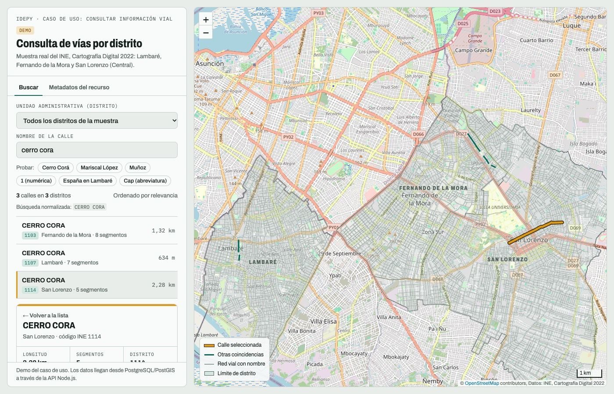
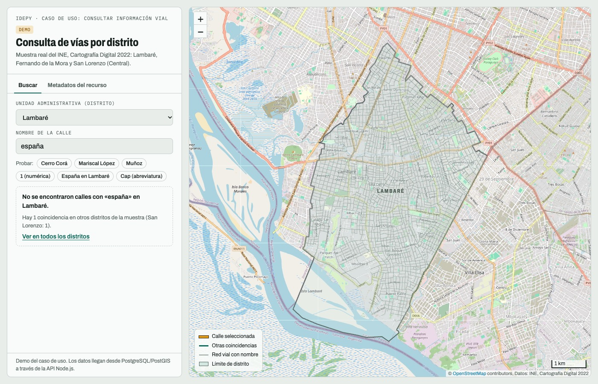
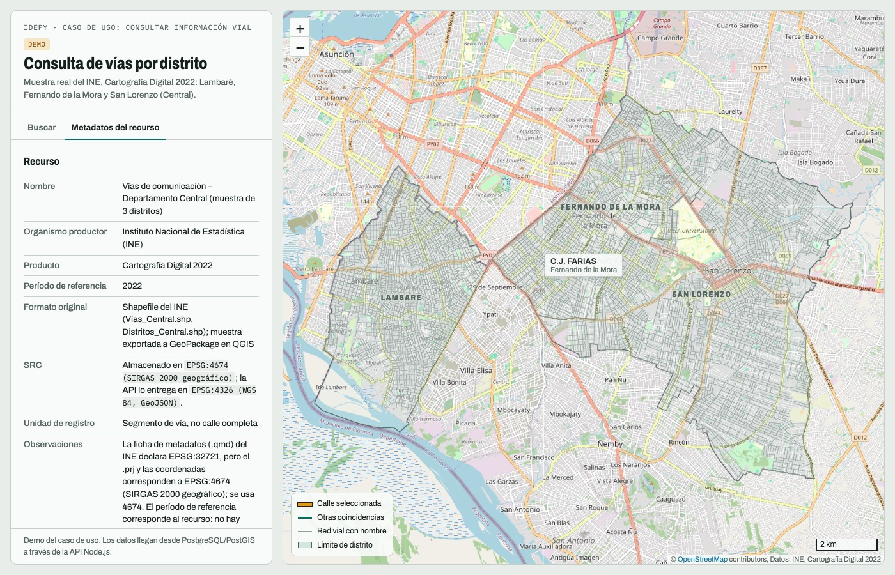
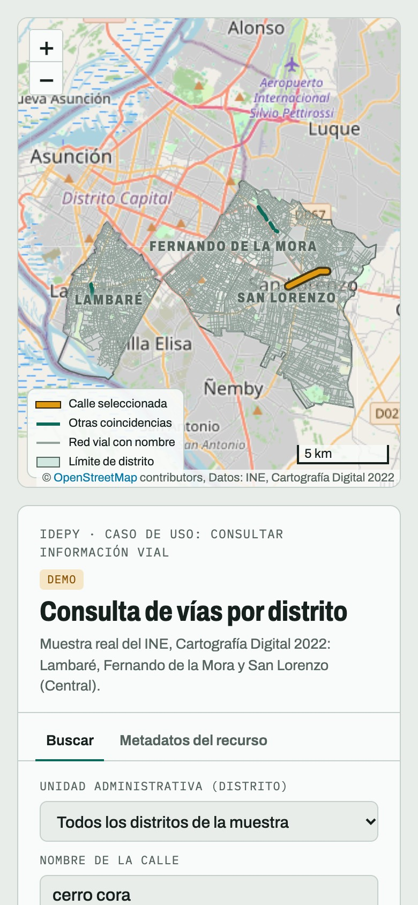
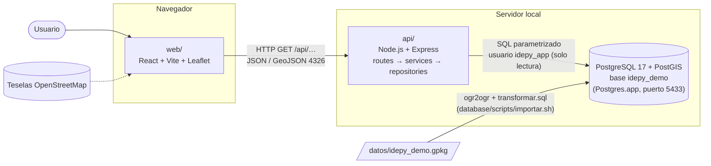
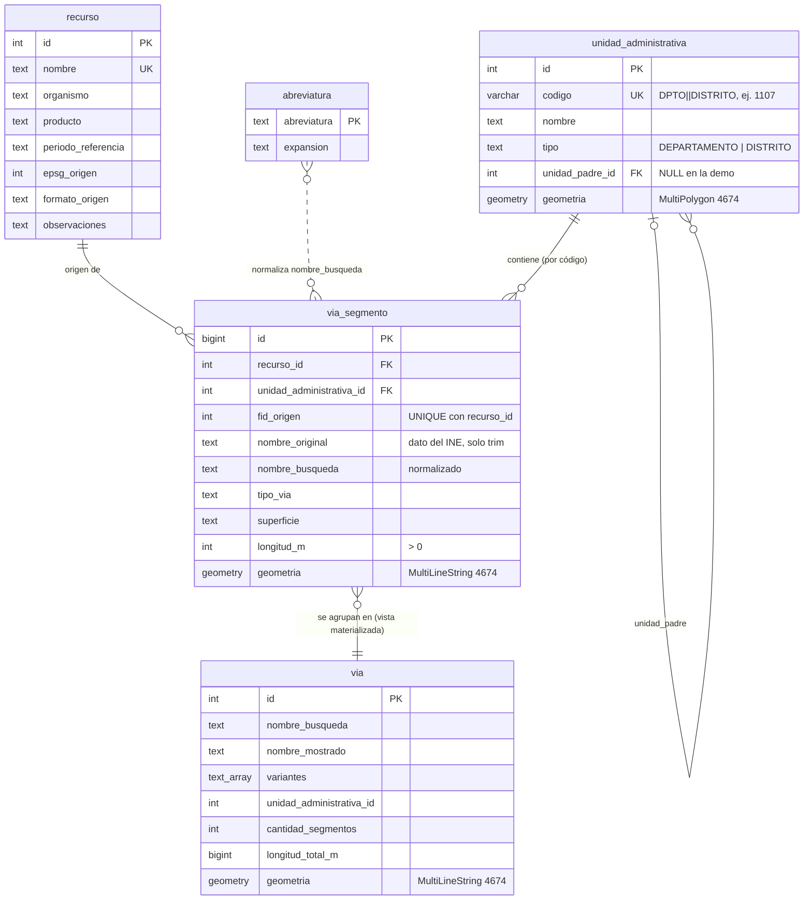

# IDEPY Demo – Consulta de calles por unidad administrativa

Trabajo práctico de **Análisis de Sistemas** sobre la **IDEPY** (Infraestructura de Datos Espaciales del Paraguay).

Es una demo acotada de **un solo caso de uso**:

> **Consultar calles según una unidad administrativa (distrito) y mostrarlas sobre un mapa.**

No es un sistema completo de IDEPY: implementa de punta a punta (datos → base espacial → API → interfaz) ese caso de uso, con datos reales del INE para tres distritos del Departamento Central.



---

## Contenido

1. [Qué hace](#1-qué-hace)
2. [Arquitectura](#2-arquitectura)
3. [Requisitos](#3-requisitos)
4. [Instalación paso a paso desde cero](#4-instalación-paso-a-paso-desde-cero)
5. [Uso](#5-uso)
6. [API](#6-api)
7. [Modelo de datos](#7-modelo-de-datos)
8. [Decisiones técnicas y su justificación](#8-decisiones-técnicas-y-su-justificación)
9. [Problemas de calidad de los datos](#9-problemas-de-calidad-de-los-datos)
10. [Pruebas y verificación](#10-pruebas-y-verificación)
11. [Estructura del repositorio](#11-estructura-del-repositorio)
12. [Solución de problemas](#12-solución-de-problemas)
13. [Limitaciones](#13-limitaciones)
14. [Próximos pasos](#14-próximos-pasos)
15. [Fuentes y licencias](#15-fuentes-y-licencias)

---

## 1. Qué hace

- **Selector de distrito**: Fernando de la Mora (1103), Lambaré (1107), San Lorenzo (1114) o todos.
- **Buscador** que ignora mayúsculas, tildes, puntuación y abreviaturas («Avda. Mcal. López» = «avenida mariscal lopez»).
- **Lista de coincidencias** ordenada por relevancia. Una calle que existe en tres distritos aparece tres veces, una por distrito.
- **Mapa** con OpenStreetMap de fondo, la red vial de la muestra, las coincidencias resaltadas y la calle seleccionada destacada. **Clic en cualquier calle del mapa** para ver su ficha.
- **Ficha de detalle**: nombre, variantes de escritura, distrito, longitud, cantidad de segmentos, desglose de tipo de vía y superficie por longitud, segmentos de origen y fuente.
- **Pestaña de metadatos**: recurso, reglas de transformación aplicadas, abreviaturas e indicadores de calidad calculados sobre los datos.
- **Sin resultados**: si no hay coincidencias en el distrito elegido, informa cuántas hay en los otros (por ejemplo, «España en Lambaré»).
- Estados de **carga** y de **error** si la API no responde, con opción de reintentar.

| Sin resultados en el distrito | Metadatos | Teléfono |
|---|---|---|
|  |  |  |

---

## 2. Arquitectura



Reglas de la arquitectura:

- **El frontend nunca se conecta a la base de datos.** Todo pasa por la API.
- La API se conecta con un usuario propio, `idepy_app`, que **solo puede leer** las tablas que usa.
- No se usa GeoServer en esta demo (ver [Próximos pasos](#14-próximos-pasos)).

Recorrido de una búsqueda:

1. El usuario escribe «mcal lopez». El frontend espera 220 ms a que deje de tipear y pide `GET /api/vias?q=mcal lopez`.
2. La API valida los parámetros y llama a la función SQL `idepy.buscar_vias('mcal lopez')`.
3. PostgreSQL normaliza el texto (`MARISCAL LOPEZ`), busca en la vista materializada `via` usando el índice trigram y devuelve las calles con un rango de relevancia.
4. La API ordena, limita a 150 resultados, transforma la geometría a EPSG:4326 y responde un GeoJSON.
5. El frontend dibuja la lista y las líneas en el mapa.

---

## 3. Requisitos

| Componente | Versión usada | Mínimo |
|---|---|---|
| macOS | Apple Silicon | (los scripts de carga usan rutas de Postgres.app) |
| [Postgres.app](https://postgresapp.com) | PostgreSQL 17.11, PostGIS 3.5.6 | PostgreSQL 17 con PostGIS, `unaccent` y `pg_trgm` |
| GDAL / `ogr2ogr` | 3.8.5 (incluido en Postgres.app) | con drivers GPKG y PostgreSQL |
| Node.js | 24.17 | `^20.19.0` o `>=22.12.0` (lo exige Vite) |
| npm | 11 | |
| git | 2.x | |
| Navegador | cualquiera moderno | con conexión a internet para las teselas de OpenStreetMap |

No hace falta instalar nada en forma global con npm: todas las dependencias quedan en `api/node_modules` y `web/node_modules`.

---

## 4. Instalación paso a paso desde cero

### 4.1. PostgreSQL con Postgres.app en el puerto 5433

1. Descargá e instalá **Postgres.app** (versión con PostgreSQL 17) desde <https://postgresapp.com> y movela a `/Applications`. Ya incluye PostGIS, `unaccent`, `pg_trgm` y `ogr2ogr`.
2. Abrí Postgres.app y **creá un servidor PostgreSQL 17 en el puerto 5433** (botón «+» de la lista de servidores → versión 17, puerto 5433) e **inicialo**.
   Usamos 5433 porque en la máquina de desarrollo ya había otro PostgreSQL (instalador EDB, sin PostGIS) en el 5432, y ese **no se toca**. Si no tenés otro servidor, igual podés usar 5433 para seguir esta guía tal cual.
3. Postgres.app crea un superusuario con **tu nombre de usuario de macOS** (`$USER`) y sin contraseña para conexiones locales.
4. Verificá la conexión. Se usa el `psql` de Postgres.app; si tenés otro `psql` en el PATH también sirve, siempre que indiques `-h localhost -p 5433`:

   ```bash
   /Applications/Postgres.app/Contents/Versions/17/bin/psql -h localhost -p 5433 -U "$USER" -d postgres \
     -c "select version();" \
     -c "select name, default_version from pg_available_extensions where name in ('postgis','unaccent','pg_trgm');"
   ```

   Resultado esperado: `PostgreSQL 17.x (Postgres.app)` y las tres extensiones.

   En el resto de la guía, `psql` puede ser el de Postgres.app (ruta de arriba) o cualquier otro cliente de PostgreSQL, siempre con `-h localhost -p 5433`.

   > La primera vez que una aplicación (Terminal, VS Code, node…) se conecta, **Postgres.app muestra un diálogo de permiso**. Si no lo aceptás, la conexión falla con `Postgres.app failed to verify "trust" authentication`. Se administra en Postgres.app → *Settings → App Permissions*.

### 4.2. Clonar el repositorio

```bash
git clone <url-del-repositorio> idepy_demo
cd idepy_demo
```

### 4.3. Configurar la contraseña del usuario de la API

```bash
cp api/.env.example api/.env
openssl rand -base64 24        # genera una contraseña; copiala en PGPASSWORD dentro de api/.env
```

`api/.env` **no se versiona** (está en `.gitignore`). El script de carga lee de ahí la contraseña para crear el usuario `idepy_app`.

### 4.4. (Recomendado) Exigir contraseña al usuario de la API

Postgres.app trae todas las conexiones locales en `trust`, es decir, **sin verificar contraseña**. Para que `idepy_app` se autentique de verdad (y no pueda entrar a otras bases), agregá el bloque de [`database/pg_hba_idepy.conf`](database/pg_hba_idepy.conf) **antes** de las líneas `trust` del `pg_hba.conf` del servidor:

```bash
# ¿Dónde está el archivo?
psql -h localhost -p 5433 -U "$USER" -d postgres -At -c "show hba_file;"
# (por ejemplo ~/Library/Application Support/Postgres/var-17/pg_hba.conf)

# Hacé una copia, editalo pegando el bloque y recargá la configuración:
psql -h localhost -p 5433 -U "$USER" -d postgres -c "select pg_reload_conf();"
psql -h localhost -p 5433 -U "$USER" -d postgres -c "select count(*) from pg_hba_file_rules where error is not null;"   # debe dar 0
```

Si omitís este paso, la demo funciona igual, pero la contraseña de `idepy_app` no se verifica.

### 4.5. Cargar los datos

```bash
./database/scripts/importar.sh
```

El script:

1. ejecuta las migraciones `database/migrations/000…007`, que crean la base `idepy_demo`, las extensiones, los esquemas, las tablas, la vista, las funciones y el usuario `idepy_app`;
2. carga el GeoPackage en el esquema `staging` con `ogr2ogr` (el `.gpkg` se abre solo para lectura);
3. ejecuta `transformar.sql` (staging → modelo final) en una transacción con controles.

Se puede ejecutar todas las veces que haga falta (es **idempotente**). Al final debe mostrar:

```
INFO:  Segmentos: staging=10712, excluidos=3, cargados=10709
```

Variables opcionales: `ADMIN_PGHOST`, `ADMIN_PGPORT` (5433), `ADMIN_PGUSER` (`$USER`) y `PGBIN` (carpeta de `psql` y `ogr2ogr`).

Verificación de la carga:

```bash
psql -h localhost -p 5433 -U "$USER" -d idepy_demo -f database/scripts/verificar.sql
```

Resultado esperado: **24 controles, todos con `ok = t`** (ver [Pruebas](#10-pruebas-y-verificación)).

### 4.6. Levantar la API

```bash
cd api
npm install
npm test        # 40 pruebas, todas deben pasar
npm start       # → API IDEPY demo escuchando en http://localhost:3000/api
```

`npm run dev` reinicia la API sola al guardar cambios. Para comprobarla: <http://localhost:3000/api/health> → `{"estado":"ok", …, "base_de_datos":"ok"}`.

### 4.7. Levantar el frontend

En otra terminal:

```bash
cd web
npm install
npm run dev     # → http://localhost:5173
```

Abrí <http://localhost:5173>. Si la API corre en otra dirección, copiá `web/.env.example` a `web/.env` y ajustá `VITE_API_URL`.

> El frontend usa **siempre el puerto 5173** (`strictPort`), porque la API solo acepta solicitudes del navegador desde `http://localhost:5173` (CORS). Si cambiás el puerto, cambiá también `CORS_ORIGIN` en `api/.env`.

---

## 5. Uso

1. Elegí un distrito (opcional) y escribí parte del nombre de una calle. También podés usar los ejemplos de «Probar».
2. Hacé clic en un resultado de la lista **o en cualquier calle del mapa** para abrir su ficha.
3. «← Volver a la lista» cierra la ficha. En la ficha, «existe también en…» abre la misma calle en otro distrito.
4. La pestaña **Metadatos del recurso** muestra la fuente, las reglas aplicadas y los problemas de calidad.

Ejemplos que muestran las reglas de búsqueda:

| Búsqueda | Qué demuestra |
|---|---|
| `cerro cora` | Una calle en 3 distritos = 3 resultados |
| `mariscal lopez` o `mcal lopez` | Expansión de abreviaturas (MCAL → MARISCAL) |
| `muñoz` | Encuentra «MU?OZ»: el nombre del INE no se corrige, pero se busca igual |
| `1` | Un número solo coincide como palabra exacta: no trae «14 DE MAYO» ni «1RO. DE MARZO» |
| `españa` en Lambaré | Sin resultados en el distrito, con aviso de 1 coincidencia en San Lorenzo |
| `cap` | Doble lectura de abreviaturas: CAPITAN… y también CAPILLA CUE, al final |
| `...` | Búsqueda inválida (sin letras ni números) |
| `a` | Más de 150 coincidencias: se muestran 150 de 1.801 |

---

## 6. API

Base: `http://localhost:3000/api`. Todas las rutas son `GET`, responden JSON y las geometrías van en **GeoJSON EPSG:4326**.

| Endpoint | Descripción |
|---|---|
| `GET /api/health` | Estado de la API y de la conexión a la base. `200` si todo está bien, `503` si la base no responde. |
| `GET /api/recurso` | Metadatos del recurso, reglas aplicadas, abreviaturas, nombres excluidos, resumen e indicadores de calidad. |
| `GET /api/unidades` | Distritos como `FeatureCollection` (polígonos), con cantidad de calles, segmentos, longitud y punto para la etiqueta. |
| `GET /api/red` | Red vial completa (2.118 calles) simplificada, para el fondo del mapa. |
| `GET /api/vias?q=&unidad=` | Búsqueda. `q`: 1 a 100 caracteres (obligatorio). `unidad`: código del distrito (opcional, ej. `1107`). |
| `GET /api/vias/:id` | Detalle de una calle (`Feature` con la geometría completa). |

Ejemplo de respuesta de búsqueda (resumida):

```json
{
  "consulta": { "q": "muñoz", "unidad": "1107", "normalizada": "MUNOZ" },
  "total": 0,
  "limite": 150,
  "hay_mas": false,
  "otras_unidades": { "total": 1, "por_unidad": [{ "codigo": "1103", "nombre": "FERNANDO DE LA MORA", "cantidad": 1 }] },
  "resultados": { "type": "FeatureCollection", "features": [] }
}
```

Cada `feature` de `resultados` trae en `properties`: `id`, `nombre` (la variante original más frecuente), `nombre_busqueda`, `variantes`, `unidad {codigo, nombre}`, `cantidad_segmentos`, `longitud_total_m` y `rango` (1 a 5, ver [8.5](#85-búsqueda)).

El detalle (`/api/vias/:id`) agrega `por_tipo_via` y `por_superficie` (segmentos, metros y porcentaje por longitud), `segmentos` (con su `fid_origen` del INE), `fuentes` y `misma_calle_en_otras_unidades`.

Errores: siempre `{ "error": { "codigo": "…", "mensaje": "…" } }`.

| Status | `codigo` | Cuándo |
|---|---|---|
| 400 | `PARAMETRO_INVALIDO` | `q` vacío, de más de 100 caracteres, repetido o sin letras ni números; `unidad` inválida o inexistente; `id` no numérico |
| 404 | `NO_ENCONTRADO` / `RUTA_NO_ENCONTRADA` | Calle o ruta inexistente |
| 503 | `BASE_NO_DISPONIBLE` / `CONSULTA_DEMORADA` | La base no responde o la consulta superó 5 s |
| 500 | `ERROR_INTERNO` | Cualquier otro error. El detalle va **solo al log**; el cliente recibe una `referencia` para buscarlo. |

Cada respuesta lleva un header `X-Request-Id`, y la API registra en consola una línea por solicitud:

```
2026-10-03T22:40:03.497Z [cd1d8813] GET /api/vias?q=a 200 11.3 ms
```

---

## 7. Modelo de datos

El DER conceptual del trabajo tiene 12 entidades. La demo implementa el subconjunto necesario para el caso de uso.



Además:

- `regla_transformacion (id, codigo, descripcion, tipo)`: las 11 reglas aplicadas, registradas como datos (filtro de distritos, SRID, exclusión, trim, normalización, abreviaturas, asignación por código, agrupación y tres reglas de búsqueda).
- `nombre_excluido (nombre, codigo_unidad, motivo)`: los 3 nombres sin significado excluidos en la importación.

**Esquemas**: `staging` guarda la carga cruda de `ogr2ogr` (la API no tiene acceso); `idepy` guarda el modelo final; `public` tiene las extensiones.

**Funciones** (esquema `idepy`):

| Función | Volatilidad | Para qué |
|---|---|---|
| `f_unaccent(text)` | IMMUTABLE | `unaccent` con diccionario calificado por esquema |
| `normalizar_texto(text)` | IMMUTABLE | Mayúsculas, sin tildes, `?`→N, no alfanumérico→espacio, trim |
| `normalizar_nombre(text)` | STABLE | `normalizar_texto` + expansión de abreviaturas (lee la tabla) |
| `buscar_vias(text)` | STABLE | La búsqueda completa: devuelve `(via_id, rango)` |

**Índices**: GiST en todas las geometrías; GIN `pg_trgm` en `via.nombre_busqueda`; índices en las FK; `UNIQUE` en `via.id` (permite `REFRESH … CONCURRENTLY`) y en `(unidad_administrativa_id, nombre_busqueda)`.

**Constraints**: `NOT NULL` en todo lo obligatorio; `CHECK` de formato de código, tipo de unidad, nombre recortado, tipos de vía y superficies válidos (los 6 y 5 valores observados), longitud positiva y geometría válida y no vacía; FK hacia recurso, unidad y unidad padre.

---

## 8. Decisiones técnicas y su justificación

### 8.1. Asignación territorial por código oficial, nunca por nombre ni por ubicación

Cada segmento se asigna al distrito cuyo `codigo` coincide con `DPTO || DISTRITO` del INE. Los nombres pueden estar escritos de distintas formas («LAMBARÉ» / «LAMBARE»). Además, **74 segmentos no tocan el polígono de su propio distrito** (quedan sobre los límites, a 5 m o menos, y 35 de ellos caen dentro del distrito vecino). Una asignación espacial los habría puesto en el distrito equivocado.

### 8.2. Nombre original y nombre de búsqueda por separado

- `nombre_original`: el dato del INE **intacto** (solo se recortan espacios en los extremos). No se corrige «MU?OZ», porque corregir sería inventar datos.
- `nombre_busqueda`: forma normalizada que se usa solo para comparar.

Así se puede buscar bien sin alterar el dato oficial.

### 8.3. Normalización implementada una sola vez, en SQL

La misma función (`idepy.normalizar_nombre`) normaliza los datos durante la carga **y** el texto que escribe el usuario. La API no reimplementa nada en JavaScript: si las reglas cambian, cambian en un único lugar.

**El problema de IMMUTABLE.** Para usar una función en un índice o en una columna generada, PostgreSQL exige que sea `IMMUTABLE` (misma entrada, mismo resultado, siempre). Hay dos obstáculos:

1. `unaccent()` es `STABLE`, porque busca su diccionario según el `search_path`. **Solución:** el *wrapper* `f_unaccent(texto)`, que llama a `public.unaccent('public.unaccent'::regdictionary, texto)` con el diccionario calificado por esquema. Ya no depende de la configuración, así que declararla `IMMUTABLE` es correcto.
2. La expansión de abreviaturas **lee una tabla**. Si alguien agrega una abreviatura, el resultado cambia, así que la función no es inmutable. Marcarla `IMMUTABLE` sería mentirle a PostgreSQL, y los índices quedarían desactualizados sin aviso. **Solución:** `normalizar_nombre` es `STABLE` y `nombre_busqueda` es una **columna materializada**, calculada durante la carga, con el índice sobre la columna.
   **Consecuencia:** si se modifica la tabla `abreviatura`, hay que ejecutar [`database/scripts/recalcular_nombre_busqueda.sql`](database/scripts/recalcular_nombre_busqueda.sql). La regla queda documentada en la tabla y en el script.

### 8.4. Abreviaturas en una tabla, con «doble lectura» en la búsqueda

Las 22 abreviaturas (AVDA/AV→AVENIDA, MCAL→MARISCAL, CNEL→CORONEL, TCNEL→TENIENTE CORONEL…) están en la tabla `abreviatura`, no escritas dentro del código.

Efecto secundario detectado: una palabra **a medio escribir** que coincide con una abreviatura se expandía. «cap» buscaba CAPITAN y no encontraba CAPILLA CUE; «ing» buscaba INGENIERO y no encontraba INGAVI. Afectaba a 6 abreviaturas y 21 calles. **Solución (opción B, elegida por el grupo):** un término de la búsqueda que es una abreviatura se cumple con su **expansión** (contenida en el nombre) **o** con su **forma literal como comienzo de una palabra**. Las coincidencias que solo se cumplen con la lectura literal van al final. Se descartó la lectura literal «contenida en cualquier parte», porque «DR» aparece dentro de PEDRO, ANDRES o ALEJANDRO. Los datos no cambian y todo sigue en SQL ([`007_busqueda_doble_lectura.sql`](database/migrations/007_busqueda_doble_lectura.sql)).

### 8.5. Búsqueda

`idepy.buscar_vias(q)` es la única implementación. La usan tanto la API como `verificar.sql`, así que **lo que se verifica es exactamente lo que usa la interfaz**.

- La consulta se normaliza y se divide en palabras (tokens). **Todas** deben cumplirse:
  - token solo numérico → palabra exacta del nombre («1» no trae «14 DE MAYO»);
  - abreviatura → doble lectura (8.4);
  - otro token → contenido en el nombre.
- Rango de relevancia: **1** coincidencia exacta, **2** empieza con la consulta, **3** todas las palabras como comienzo de palabra, **4** resto, **5** solo por lectura literal de una abreviatura. Después, orden alfabético y por distrito.
- **Índice trigram:** `pg_trgm` no puede usar el índice con `LIKE ALL (…)` ni con `OR`. Por eso se agrega una condición redundante con el token no abreviatura más largo (el más selectivo), que sí usa el índice. Comprobado con `EXPLAIN`: la búsqueda pasó de unos 7 ms a unos 2 ms.
- Límite de 150 resultados, con `total` y `hay_mas` para avisar que hay más.

### 8.6. «Calle» = vista materializada `via`

Cada registro del INE es un **segmento**, no una calle. Una calle es el conjunto de segmentos con igual (`nombre_busqueda`, `unidad_administrativa_id`), así que una calle que existe en tres distritos son tres resultados. Se usa una vista **materializada** porque los datos cambian solo al reimportar: la agrupación se calcula una vez y cada búsqueda lee un resultado ya agrupado e indexado.

- `nombre_mostrado`: la variante original más frecuente (desempate: mayor longitud y luego orden alfabético). Las demás quedan en `variantes`.
- Geometría: `ST_Collect` sobre MultiLineStrings devuelve un GEOMETRYCOLLECTION. Por eso primero se separa cada segmento en sus líneas (`ST_Dump`) y después se juntan con `ST_Multi(ST_Collect(…))`. No se fusionan ni se modifican las líneas.
- `id` determinístico (`row_number()` ordenado por código de distrito y nombre): la misma carga da los mismos `id`.

### 8.7. Carga reproducible: staging + transformación con controles

`ogr2ogr` copia el GeoPackage tal cual al esquema `staging`. Después, `transformar.sql` aplica las reglas en **una sola transacción**, con controles que abortan la carga si algo no cuadra (una unidad cuya `CLAVE` no es `DPTO||DISTRITO`, un segmento sin distrito, o una cantidad cargada distinta de staging menos excluidos). Si algo falla, la base queda como estaba, nunca a medias. Separar lo crudo de lo transformado permite repetir la transformación sin volver a QGIS.

### 8.8. Exclusión de nombres basura por lista explícita

«S7n» (Lambaré), «O» (San Lorenzo) y «S» (Fernando de la Mora) se excluyen mediante la tabla `nombre_excluido`, no con una heurística. Un criterio como «menos de 2 letras» también habría eliminado nombres válidos como la calle «1».

### 8.9. Sistemas de referencia

Las geometrías se guardan en **EPSG:4674** (SIRGAS 2000), el sistema real de los datos, y la API las entrega en **EPSG:4326** con `ST_Transform`, porque es lo que espera GeoJSON y Leaflet. La ficha `.qmd` del INE declara EPSG:32721 por error; se usa 4674, según el `.prj` y las coordenadas.

### 8.10. Geometría en la API: simplificada en listas, completa en el detalle

- `/api/vias` incluye la geometría de cada resultado, simplificada con `ST_SimplifyPreserveTopology` a unos 2 m y con 6 decimales (unos 0,1 m). El motivo principal es que el mapa debe dibujar todas las coincidencias y permitir elegirlas con un clic; sin geometría serían hasta 150 solicitudes extra. La simplificación ahorra solo un 18%, porque los segmentos del INE ya son casi rectos. El peor caso pesa unos 83 KB.
- `/api/red` envía las 2.118 calles simplificadas para el fondo del mapa. El JSON se arma en PostgreSQL con `json_agg`, y con **gzip** pasa de unos 970 KB a unos 175 KB.
- `/api/vias/:id` devuelve la geometría **completa**.
- Los endpoints de catálogo (`/recurso`, `/unidades`, `/red`) llevan `Cache-Control: max-age=300` más el ETag de Express.

### 8.11. Seguridad

- Usuario `idepy_app` con **permisos mínimos**: `SELECT` sobre las tablas, la vista y las funciones que usa. Sin acceso a `staging` y sin permiso para crear objetos.
- Defensa en profundidad: `default_transaction_read_only = on` (aunque tuviera un permiso de escritura por error, no podría escribir) y `statement_timeout = 5s`.
- `pg_hba.conf`: `scram-sha-256` para `idepy_app` en `idepy_demo` y `reject` en cualquier otra base.
- Solo **consultas parametrizadas** (`$1, $2…`). Hay una prueba que busca `'; DROP TABLE idepy.via; --` y verifica que se trate como texto.
- La contraseña vive solo en `api/.env`, que no se versiona; `.env.example` tiene un valor de ejemplo.
- CORS limitado a `http://localhost:5173` y al método GET; no se envía el header `X-Powered-By`; los errores no exponen detalles internos.

### 8.12. API en capas

`routes` (reciben y responden) → `services` (validación y reglas del caso de uso) → `repositories` (SQL) → `db/pool`. Express 5 lleva los errores de las funciones `async` al manejador central sin `try/catch` en cada ruta. Las variables de entorno se cargan con el `--env-file` nativo de Node, sin la dependencia `dotenv`. Las pruebas usan `node:test` (nativo) y `supertest`.

### 8.13. Frontend

- React + Vite + `react-leaflet`.
- Cada capa del mapa (distritos, red y coincidencias, calle seleccionada) va en su propio *pane* con un renderer *canvas*, que dibuja miles de líneas sin problema. Los panes sin elementos clickeables ignoran el puntero; si no, su canvas taparía los clics de las capas de abajo (es un bug que encontramos al probar).
- La búsqueda espera a que el usuario deje de tipear y **cancela los pedidos viejos** (`AbortController`), así una respuesta lenta nunca pisa a una más nueva.
- La interfaz replica la de [`docs/prototipo-referencia.html`](docs/prototipo-referencia.html), validada con el profesor. Los datos del prototipo que no salen de nuestra base (por ejemplo, el porcentaje de segmentos con nombre por distrito) se quitaron, para no inventar datos.

### 8.14. Otros

- **Departamento:** Central no se carga como fila porque no tenemos su polígono y la geometría es obligatoria; `unidad_padre_id` queda en NULL.
- **Longitud:** se usa `Long_Metro` del INE. Se comparó con el largo geodésico calculado con PostGIS: la diferencia media es de 0,26 m y la máxima de 1,3 m.

---

## 9. Problemas de calidad de los datos

Fuente: INE, Cartografía Digital 2022. La muestra se preparó en QGIS a partir de `Vías_Central.shp` y `Distritos_Central.shp`.

| # | Problema | Cantidad | Tratamiento |
|---|---|---|---|
| 1 | La ficha `.qmd` declara **EPSG:32721**, pero el `.prj` y las coordenadas son **EPSG:4674** | todo el recurso | Se usa 4674; queda registrado en `recurso.observaciones` |
| 2 | **«?» en lugar de Ñ** («?ACUNDAY», «MU?OZ», «CERRO PORTE?O»…) | 75 segmentos, 11 nombres | No se corrige el original; la normalización convierte `?`→N, así que «muñoz» encuentra «MU?OZ». La interfaz lo marca. |
| 3 | Otros caracteres dañados que no se corrigen («ARGAAA», «ARGACA», «MONSEOOR», «MONSEROR») | algunos nombres | Se conservan; no se agrupan con su forma correcta |
| 4 | **Variantes de escritura** de la misma calle en un distrito («GRAL. GENES» / «GENERAL GENES», «AVDA, CACIQUE LAMBARE» con coma) | 21 calles | Se agrupan al normalizar; la ficha muestra las variantes |
| 5 | **Espacios dobles internos** («PEDRO V.  GILL») | 10 segmentos, 8 nombres | El original se conserva; la normalización los colapsa |
| 6 | **Nombres sin significado** que pasaron el filtro de QGIS: «S7n», «O», «S» | 3 segmentos | Excluidos en la importación (tabla `nombre_excluido`) |
| 7 | **Segmentos que no tocan el polígono de su distrito** | 74 (35 caen en el vecino) | Asignación por código, no espacial |
| 8 | **Sin fecha ni responsable por calle**: la fecha es del recurso | — | Se informa el período del recurso (2022); no se inventan fechas |

Los indicadores 2, 4 y 7 se **calculan** sobre los datos cargados (`/api/recurso` → `calidad`); no están escritos a mano.

---

## 10. Pruebas y verificación

| Qué | Comando | Resultado esperado |
|---|---|---|
| Carga de datos | `./database/scripts/importar.sh` | `staging=10712, excluidos=3, cargados=10709` |
| Controles de la base | `psql -h localhost -p 5433 -U "$USER" -d idepy_demo -f database/scripts/verificar.sql` | 24 filas con `ok = t` |
| API (unitarias + integración) | `cd api && npm test` | `tests 40, pass 40, fail 0` |
| Solo validación (sin base) | `cd api && npm run test:unit` | `tests 10, pass 10` |
| Build del frontend | `cd web && npm run build` | `✓ built` |

Qué cubre `verificar.sql`:

- 3 unidades; 10.712 segmentos en staging y 10.709 cargados; 0 segmentos con nombre excluido;
- 0 segmentos sin unidad o con una unidad que no coincide con su código de origen;
- 0 geometrías nulas, vacías o inválidas; SRID 4674 en todas;
- conteo por distrito (1103 = 3.222, 1107 = 4.344, 1114 = 3.143); sumas de la vista iguales a las de la tabla;
- «?» conservado (75 / 11);
- búsquedas: «cerro cora» → 3 calles en 3 distritos, «mariscal lopez» → 3, «muñoz» → «MU?OZ», «1» → «1», «CALLE 1», «D027 - EX RUTA 1» y «PASILLO 1»;
- doble lectura de abreviaturas.

Las pruebas de la API cubren los 6 endpoints, las búsquedas obligatorias, el filtro y el aviso de otras unidades, el límite de 150, los desgloses (que suman la longitud total), las validaciones (400), los 404, CORS, gzip y caché.

Además, la interfaz se recorrió en Chrome *headless*: carga inicial, ejemplos, clic en la lista y en el mapa (red y coincidencias), filtro por distrito, búsqueda inválida y masiva, metadatos, modo claro y oscuro, vista de teléfono sin scroll horizontal y **API apagada**. No quedaron errores en la consola.

---

## 11. Estructura del repositorio

```
idepy_demo/
├── README.md
├── database/
│   ├── migrations/                  SQL numerado e idempotente
│   │   ├── 000_crear_base.sql       base idepy_demo (se ejecuta contra "postgres")
│   │   ├── 001_extensiones_esquemas.sql
│   │   ├── 002_normalizacion.sql    f_unaccent, normalizar_texto, abreviatura, normalizar_nombre
│   │   ├── 003_tablas.sql           recurso, unidad_administrativa, via_segmento, reglas, excluidos
│   │   ├── 004_datos_referencia.sql recurso, reglas y nombres excluidos
│   │   ├── 005_vista_via.sql        vista materializada via (+ primera versión de buscar_vias)
│   │   ├── 006_rol_app.sql          usuario idepy_app con permisos mínimos
│   │   └── 007_busqueda_doble_lectura.sql  buscar_vias definitiva y reglas de búsqueda
│   ├── scripts/
│   │   ├── importar.sh              carga completa reproducible
│   │   ├── transformar.sql          staging → idepy con controles
│   │   ├── verificar.sql            24 controles con resultado esperado
│   │   └── recalcular_nombre_busqueda.sql
│   └── pg_hba_idepy.conf            bloque de autenticación para idepy_app
├── api/
│   ├── .env.example
│   ├── src/
│   │   ├── server.js · app.js · config.js · errores.js
│   │   ├── db/pool.js
│   │   ├── routes/index.js
│   │   ├── services/                validacion.js, viasService.js, catalogoService.js
│   │   ├── repositories/            viasRepository.js, unidadesRepository.js, recursoRepository.js, saludRepository.js
│   │   └── middleware/              registroSolicitudes.js, errores.js
│   └── test/                        validacion.test.js (unitarias), api.test.js (integración)
├── web/
│   ├── .env.example · index.html · vite.config.js
│   └── src/
│       ├── main.jsx · App.jsx · api.js · hooks.js · formato.js · estilos.css
│       └── components/              Buscador, ListaResultados, FichaDetalle, Metadatos, Mapa
├── datos/idepy_demo.gpkg            muestra preparada en QGIS (no se modifica)
├── docs/
│   ├── prototipo-referencia.html    prototipo de interfaz validado
│   └── img/                         capturas de este README
└── qgis/idepy_demo.qgz              proyecto QGIS de preparación (no se modifica)
```

**Historial de git**: una rama por fase, integrada en `main` con `merge --no-ff`, así cada fase queda como un bloque en el historial (`git log --oneline --graph`).

---

## 12. Solución de problemas

| Síntoma | Causa probable | Solución |
|---|---|---|
| `Postgres.app failed to verify "trust" authentication` | No se aceptó el diálogo de permisos de Postgres.app | Postgres.app → *Settings → App Permissions* → permitir la aplicación |
| `importar.sh`: `No hay conexión a localhost:5433` | El servidor no está iniciado o usa otro puerto | Iniciar el servidor en Postgres.app; revisar el puerto o usar `ADMIN_PGPORT` |
| `importar.sh`: `Falta api/.env` o `Cambiá el PGPASSWORD de ejemplo` | Paso 4.3 sin hacer | `cp api/.env.example api/.env` y definir `PGPASSWORD` |
| La API no arranca: `Faltan variables de entorno` | `api/.env` incompleto | Completar según `api/.env.example` |
| `/api/health` → 503 / `BASE_NO_DISPONIBLE` | Postgres apagado o contraseña de `idepy_app` distinta a la de `api/.env` | Iniciar Postgres.app; volver a correr `importar.sh` (actualiza la contraseña) |
| `password authentication failed for user "idepy_app"` | Se cambió `PGPASSWORD` sin recargar el usuario | Volver a correr `importar.sh` |
| El frontend dice «No se pudo conectar con la API» | La API no está corriendo | `cd api && npm start` |
| Error de CORS en la consola del navegador | El frontend no está en `http://localhost:5173` | Usar el 5173 o ajustar `CORS_ORIGIN` |
| `npm run dev`: `Port 5173 is already in use` | Otro proceso usa el puerto | Cerrar ese proceso (el puerto es fijo a propósito) |
| El mapa se ve sin calles de fondo | Sin internet (teselas de OSM) | La red vial de la muestra se sigue viendo; las teselas requieren conexión |

---

## 13. Limitaciones

- **Alcance:** solo 3 distritos de Central y un caso de uso. El departamento no está modelado como unidad (falta su polígono).
- **Calles homónimas:** dos calles físicamente distintas con el mismo nombre dentro de un distrito se agrupan como una.
- **Agrupación por texto:** variantes que no coinciden al normalizar (por errores de la fuente, como «ARGA» / «ARGACA») quedan como calles separadas.
- **«?» → N:** en los 11 casos observados reemplaza a la Ñ; en otro conjunto de datos podría no ser así.
- **Búsqueda sin tolerancia a errores de tipeo:** se busca por contenido, no por similitud.
- **`id` de calle:** es estable entre recargas de los mismos datos, pero puede cambiar si se reimportan datos distintos.
- **Abreviaturas:** si se cambia la tabla, hay que recalcular `nombre_busqueda` (script incluido).
- **Entorno:** `importar.sh` asume macOS + Postgres.app (se puede ajustar con `PGBIN` y las variables `ADMIN_*`). La configuración de `pg_hba.conf` es manual.
- **Mapa base:** depende de las teselas públicas de OpenStreetMap, aptas para una demo pero no para uso intensivo en producción.
- **Sin autenticación de usuarios:** es una consulta pública de solo lectura.

---

## 14. Próximos pasos

- **GeoServer:** publicar las capas como servicios OGC (WMS/WFS), que es lo que hace interoperable a una IDE, y que la interfaz los consuma.
- **Metadatos estándar:** ficha ISO 19115 del recurso y catálogo CSW (por ejemplo, GeoNetwork).
- **Docker / docker-compose** con PostgreSQL + PostGIS, API y frontend, para instalar con un solo comando en cualquier sistema.
- **Más departamentos y todo el país**, con la jerarquía departamento → distrito usando `unidad_padre_id`.
- **Asunción (Distrito Capital):** incorporarla requiere contemplar su codificación particular, porque no pertenece a un departamento.
- **Completar el DER** de 12 entidades (versionado de recursos, responsables, historial).
- **Búsqueda tolerante a errores** con similitud trigram (`pg_trgm`) y paginación de resultados.
- **Calidad de datos:** reportar al INE los caracteres dañados y la inconsistencia del EPSG en la ficha `.qmd`.
- **Pruebas E2E automatizadas** (por ejemplo, Playwright) e integración continua.

---

## 15. Fuentes y licencias

- **Datos viales y distritales:** Instituto Nacional de Estadística (INE), Paraguay. Cartografía Digital 2022.
- **Mapa base:** © colaboradores de [OpenStreetMap](https://www.openstreetmap.org/copyright), datos bajo licencia ODbL. Las teselas se usan según la [política de uso de teselas de OSM](https://operations.osmfoundation.org/policies/tiles/).
- **Software:** PostgreSQL, PostGIS, GDAL, Node.js, Express, React, Vite, Leaflet y react-leaflet, cada uno bajo su propia licencia de código abierto.
